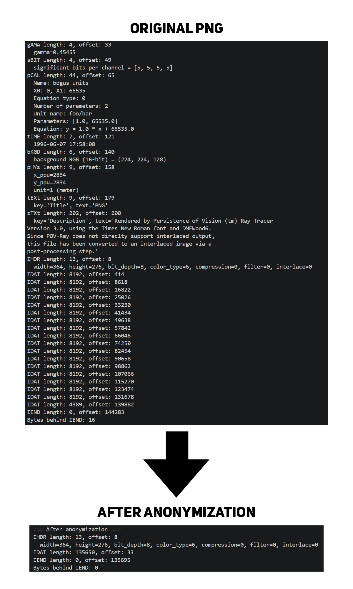

# PNG encryption

## Projects

### 1️. PNG Analysis and Anonymization
The project in folder `1` consisted of:
- analyzing the structure of the PNG file,
- displaying the Fourier transform,
- anonymizing the file.
- main file: main1.py

### 2. Encrypting and Decrypting PNG
The project in folder `2` consisted of:
- encrypting the data in the PNG file (chunk `IDAT`),
- decrypting the file and restoring the original content.
- main file: main.py

## Technologies
- Python
